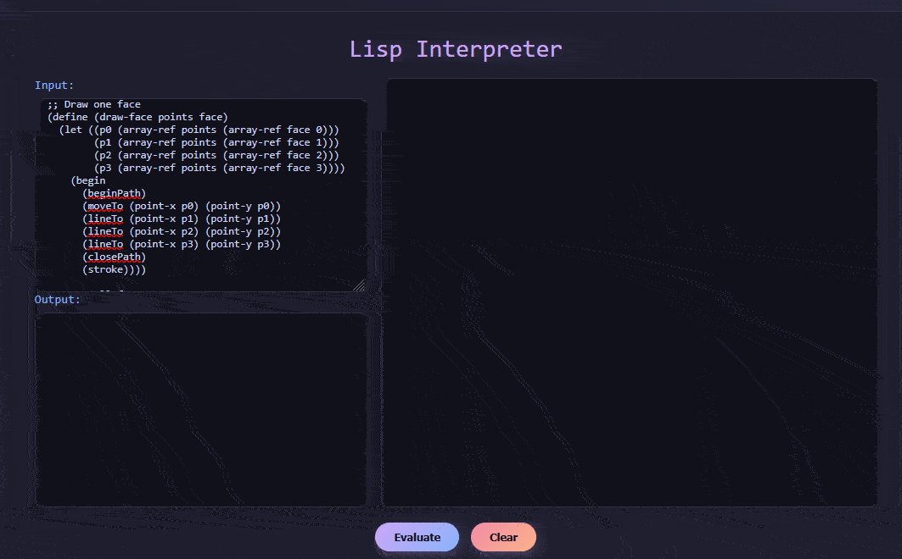

# lispyjs

**lispyjs** is a JavaScript adaptation of Peter Norvig's minimalist Lisp interpreter, [Lispy](https://norvig.com/lispy.html), originally implemented in Python in under 100 lines. This version runs in the browser and extends the original with graphical and interactive capabilities via the HTML5 Canvas API.

## Screenshots

**Rotating Donut**  

**Rotating Cube**  

**Colorful Spiral**  

## Features

-   A lightweight Lisp interpreter written in JavaScript, based on Norvig's Lispy
-   Integration with the Canvas API for 2D and 3D drawing operations
-   Support for `requestAnimationFrame` to enable animations
-   Basic string literal support (e.g., `"hello world"`)
-   Function definition, list manipulation, and simple REPL evaluation
-   Constant and let definitions
-   for-each, filter, map, range, apply and other commonly used Lisp functions
-   Designed for clarity, extensibility, and experimentation

## Limitations

This is not a complete Lisp or Scheme implementation. The interpreter covers a useful subset of Lisp syntax and semantics, suitable for exploration, small experiments, and graphical demos.

## Background and Inspiration

This project is based on the article [“(How to Write a (Lisp) Interpreter (in Python))”](https://norvig.com/lispy.html) by Peter Norvig. The JavaScript version retains the educational simplicity of the original while enabling browser-based graphics and interactivity.

## License

This project is licensed under the MIT License.
